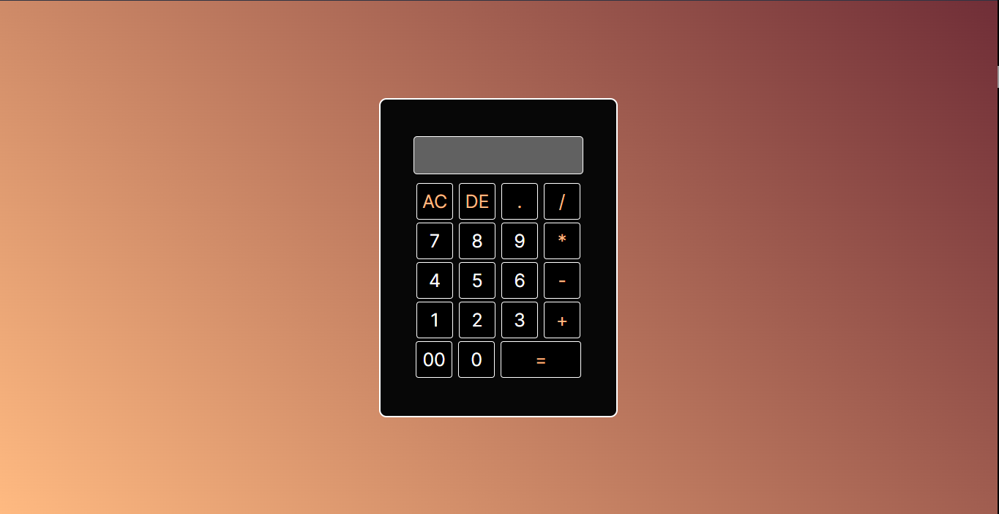

# Primeira Calculadora 

<html>
    
</html>

## Linguagens usadas:
```Html,```
```CSS,```
```JavaScript```

### Trabalho pessoal para a busca de mais conhecimento das linguagens.
<html>
    <br>
</html>

###### Autor:


[<br><sub>Robson André</sub>](https://github.com/Robson-oliveiraa)